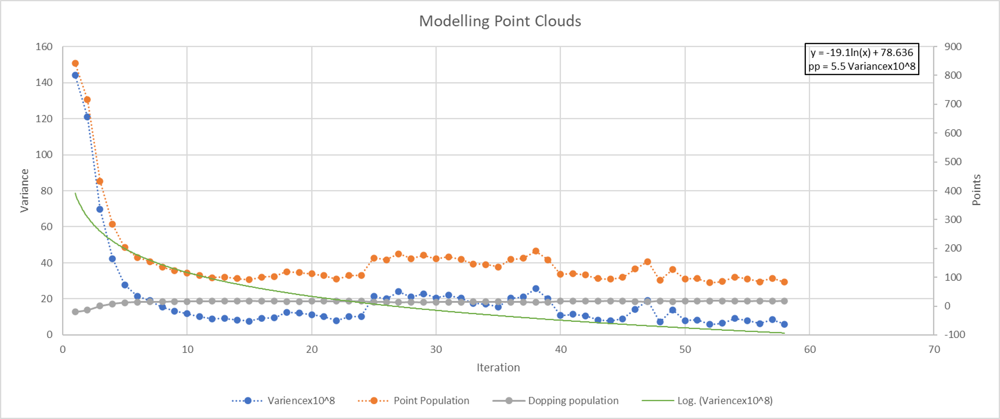
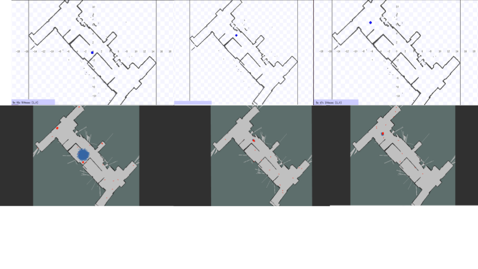
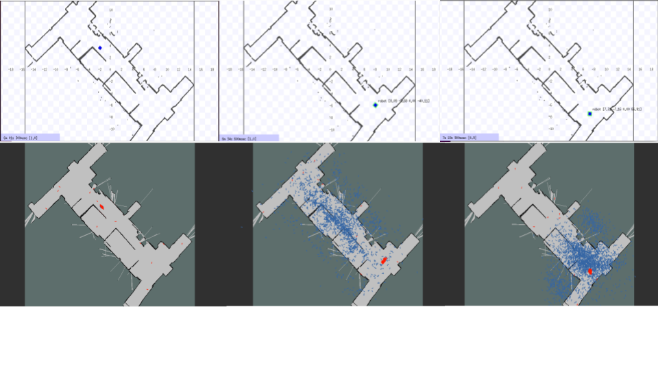

# Variance based Adaptive Monte Carlo Localisation
This projects presennts an implementation of a variance-based adaptive particle filter localization algorithm(VAMCL). Equipped with a systematic re-sampling method based on the laser-scan data stream, correcting the belief distribution. A Density-based clustering (DBscan)and weighted averaging is used to estimate a robot’s state variables. 
The results are then compared with the adaptive Monte-Carlo filter in the ROS(noetic) package, including tests for edge cases such as the ’kidnap robot’ problem

## Varianc based particle adaptation

The particle population was altered based on variance in error of a 6-dimensional pos-vector. more details in the [report](https://drive.google.com/file/d/1lUWaYRXgXfchTuDHWAW5DvLWny498ybV/view?usp=sharing).



<i>Figure showing the adaptation of particle population (orange) and dopping points (gray) according to a Logarithmic fit(green) of error variance in prediction</i>

## Performance comparision
### Scenario: Differential drive robot normal movement

_Figure showing algorithm preformace against build in ros-noetic AMCL package in regular localisation scenario VAMCL(red) and AMCL(blue)_

## Scenario: Kidnap robot problem

_Figure showing algorithm preformace against build in ros-noetic AMCL package in kidnapped robot (offline transportation of robot) situation for VAMCL(red) and AMCL(blue)_

### Building the Package:
 
* This package is written for ROS1 noetic.

* Rename the repository to `src` after moving to your catkin workspace (`src` directory)
* Rebuild catkin workspace 
        
        catkin_make    # ----- run from root directory of catkin workspace

* Compile laser_trace.cpp (provides laser ray tracing) as follows **if you are not using arm system(windows, unix...)**:

        cd <catkin_ws>/src/pf_localisation/src/laser_trace
        ./compile.sh #You may have to '''chmod +x compile.sh'''

* replace `./compile.sh` with `./compilearm.sh`  **if you are using arm system(m1 chip mac)**:

If correctly compiled, you should find `laser_trace.so` in the directory `<catkin_ws>/src/pf_localisation/src/pf_localisation`.
If the ***code does not compile*** you need to install PythonBoost from https://github.com/boostorg/python. This requires the download and compiling of Boost and installation of Faber.

### Running the node:

#### On real robot:

        roscore  # ----- not necessary if roslaunch is called before running any nodes with rosrun
        roslaunch socspioneer p2os_laser.launch
        roslaunch socspioneer teleop_joy.launch # ----- for teleoperation control (if implementing automatic collision avoidance node, run that instead)
        rosrun map_server map_server <path_to_your_map_yaml_file>
        rosrun pf_localisation node.py    # ----- requires laser_trace, and completed pf.py methods.

#### In simulated world:

The localisation node can be tested in stage simulation (without the need for robot).

        roscore
        rosrun map_server map_server <catkin_ws>/map.yaml
        rosrun stage_ros stageros <catkin_ws>/src/socspioneer/data/meeting.world
        roslaunch socspioneer keyboard_teleop.launch  # ---- run only if you want to move robot using keyboard 
        rosrun pf_localisation node.py    # ----- requires laser_trace, and completed pf.py methods.

**Don't forget to make node.py executable by using ```chmod +x node.py```**

### Published Topics:

Running the node successfully will publish the following topics:

* `/map` 
* `/amcl_pose` 
* `/particle_cloud`

All of these can be visualised in RViz by adding the appropriate Views.

This project is built on top of the [pf_localisation](https://github.com/IRUOB/pf_localisation) github repository.